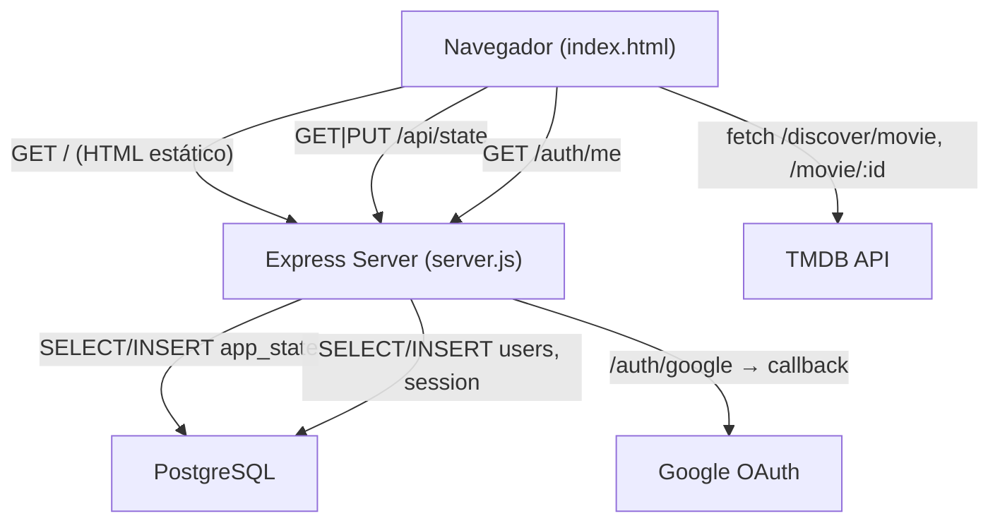
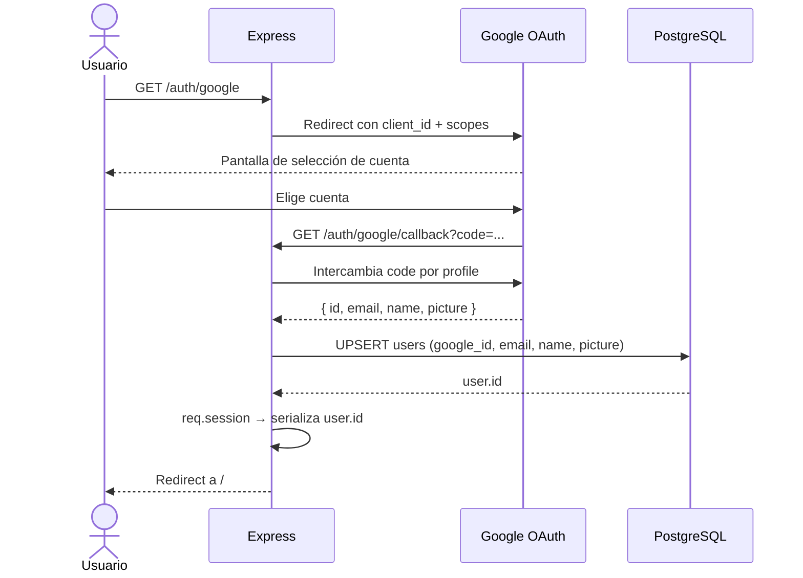
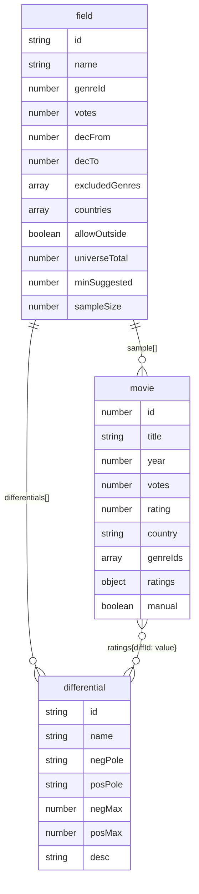

# Genealogía del Cine

Herramienta web para investigadores que analizan géneros cinematográficos usando un método basado en la teoría de Gilbert Simondon. El investigador define un universo de películas, extrae una muestra representativa, aplica tensiones narrativas binarias (**diferenciales**) a cada película y calcula la **metaestabilidad** del género.

---

## Stack

| Capa | Tecnología |
|------|-----------|
| Frontend | HTML + JS + CSS (single file `index.html`) |
| Gráficos | Chart.js 4.4.1 |
| Backend | Node.js + Express |
| Base de datos | PostgreSQL (Railway) |
| Autenticación | Google OAuth 2.0 via Passport.js |
| Sesiones | express-session + connect-pg-simple |
| Datos de películas | TMDB API |
| Deploy | Railway |

---

## Arquitectura



---

## Flujo de autenticación



---

## Modelo de datos

```mermaid
erDiagram
    users {
        serial id PK
        text google_id UK
        text email UK
        text name
        text picture
        timestamp created_at
    }
    app_state {
        integer user_id PK FK
        jsonb data
        timestamp updated_at
    }
    session {
        varchar sid PK
        json sess
        timestamp expire
    }

    users ||--|| app_state : "tiene"
    users ||--o{ session : "genera"
```

### Estructura del campo (dentro de `app_state.data`)



---

## Variables de entorno

| Variable | Descripción |
|----------|-------------|
| `DATABASE_URL` | Connection string de PostgreSQL (Railway lo inyecta automáticamente) |
| `GOOGLE_CLIENT_ID` | Client ID de la app en Google Cloud Console |
| `GOOGLE_CLIENT_SECRET` | Client Secret de la app en Google Cloud Console |
| `SESSION_SECRET` | String arbitrario para firmar cookies de sesión |

---

## Correr localmente

```bash
npm install

# Crear archivo .env con las variables de entorno
DATABASE_URL=postgresql://...
GOOGLE_CLIENT_ID=...
GOOGLE_CLIENT_SECRET=...
SESSION_SECRET=cualquier-string

node server.js
```

La app queda disponible en `http://localhost:3000`.

> Para que Google OAuth funcione localmente hay que agregar `http://localhost:3000/auth/google/callback` como URI autorizada en Google Cloud Console.

---

## Estructura del proyecto

```
├── index.html      # App completa (frontend + lógica)
├── login.html      # Pantalla de login (pública)
├── help.html       # Centro de ayuda (público)
├── help-img/       # Capturas de pantalla para el centro de ayuda
├── server.js       # Express: auth, API /api/state, archivos estáticos
├── package.json
└── CLAUDE.md       # Contexto del proyecto para Claude Code
```

---

## API

| Método | Ruta | Auth | Descripción |
|--------|------|------|-------------|
| `GET` | `/auth/google` | — | Inicia flujo OAuth |
| `GET` | `/auth/google/callback` | — | Callback de Google |
| `GET` | `/auth/logout` | — | Cierra sesión |
| `GET` | `/auth/me` | ✓ | Devuelve `{ id, name, email, picture }` |
| `GET` | `/api/state` | ✓ | Devuelve el estado del usuario `{ fields: [] }` |
| `PUT` | `/api/state` | ✓ | Guarda el estado del usuario |

---

## Conceptos clave del método

**Campo:** unidad de trabajo. Define un universo de películas por género, décadas, votos mínimos y países.

**Muestra:** subconjunto representativo del universo sobre el que se aplica el análisis. El índice de representatividad mide qué tan bien replica la muestra la distribución del universo.

**Diferencial:** tensión narrativa binaria con dos polos (ej: Naturaleza / Técnica). Cada película recibe un valor de −N a +N en cada diferencial.

**Metaestabilidad:** promedio de los valores absolutos de todas las calificaciones de una película, dividido por el valor máximo del rango. Indica qué tan fuerte tensiona la película los diferenciales del género. Alta metaestabilidad = película transformadora; baja = película estable.
